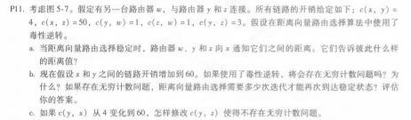
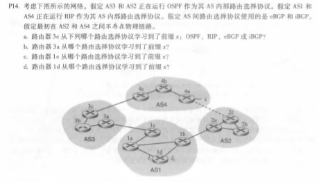
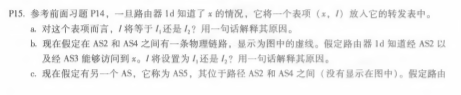

# 网络及分布式计算第十次作业

#### 2017302580018  刘佳媚

---

### 1、P11

  解：

a、

​    z：通知w，Dz(x) = ∞。通知y，Dz(x) = 6。

​    w：通知y，Dw(x) = ∞。通知y，Dw(x) = 5。

​    y：通知w，Dy(x) = 4。通知z，Dy(x) = 4。

b、

是的，会有一个无穷计数问题。下表显示了路由收敛过程。

|      | t0         | t1         | t2          | t3          | t4          | ......  |
| ---- | ---------- | ---------- | ----------- | ----------- | ----------- | ------- |
| z    | →w,Dz(x)=∞ |            |             | →w,Dz(x)=∞  |             | ......  |
|      | →y,Dz(x)=6 |            |             | →y,Dz(x)=11 |             | ......  |
| w    | →y,Dw(x)=∞ |            | →y,Dw(x)=∞  |             |             | ....... |
|      | →z,Dw(x)=5 |            | →z,Dw(x)=10 |             |             | ......  |
| y    | →w,Dy(x)=4 | →w,Dy(x)=9 |             |             | →w,Dy(x)=14 | ......  |
|      | →z,Dy(x)=4 | →z,Dy(x)=∞ |             |             | →z,Dy(x)=∞  | ......  |

 我们看到w，y，z在计算路由器x的开销时形成一个循环。如果我们继续上面表中所示的迭代，那么在t27，z通过它与x的直接联系检测到它对x的最小成本是50。在t29，w通过z得知它对x的最小成本为51。在t30，y将其最小成本更新为52(通过w)。最后，在t31，没有更新，路由是稳定的。

|      | t27         | t28         | t29         | t30         | t31         |
| ---- | ----------- | ----------- | ----------- | ----------- | ----------- |
| z    | →w,Dz(x)=50 |             |             | →w,Dz(x)=50 | →w,Dz(x)=50 |
|      | →y,Dz(x)=50 |             |             | →y,Dz(x)=50 | →y,Dz(x)=50 |
| w    |             |             | →y,Dw(x)=51 |             | →y,Dw(x)=51 |
|      |             |             | →z,Dw(x)=∞  |             | →z,Dw(x)=∞  |
| y    |             | →w,Dy(x)=53 |             | →w,Dy(x)=∞  | →w,Dy(x)=∞  |
|      |             | →z,Dy(x)=∞  |             | →z,Dy(x)=52 | →z,Dy(x)=52 |

c、切断y和z之间的连接。

------

### 2、P14

  解：

a、eBGP

b、iBGP

c、eBGP

d、iBGP

------

### 3、P15

  解：

a、I1，因为这是1D知道x情况的最低成本路径。

b、I2，因为这两种都有相等的AS-PATH，但I2开始的路径穿越的链路更少。

c、I1，因为通过I1的AS-PATH更短。
