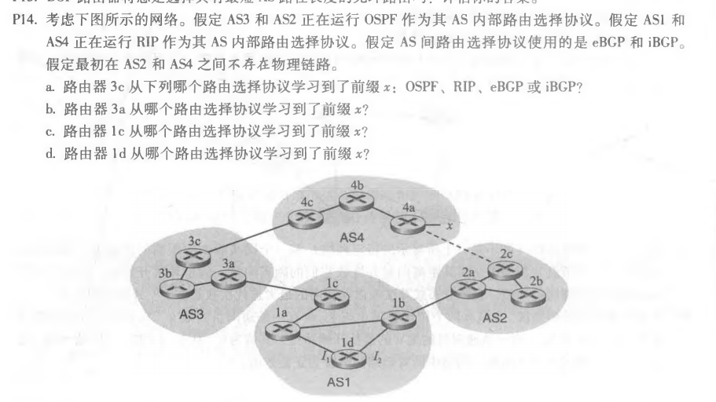
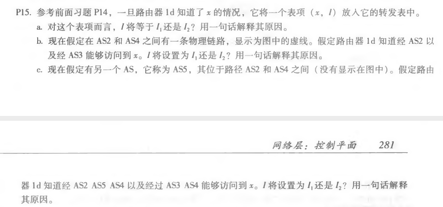
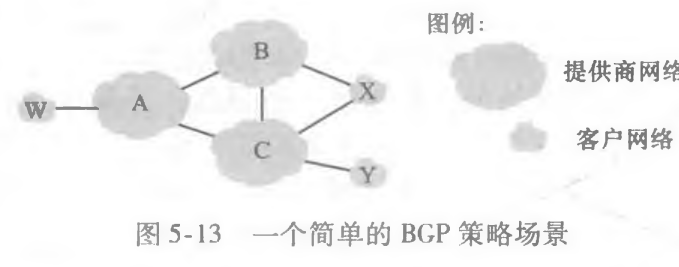
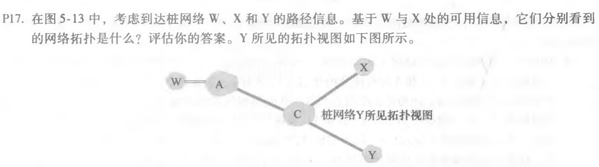
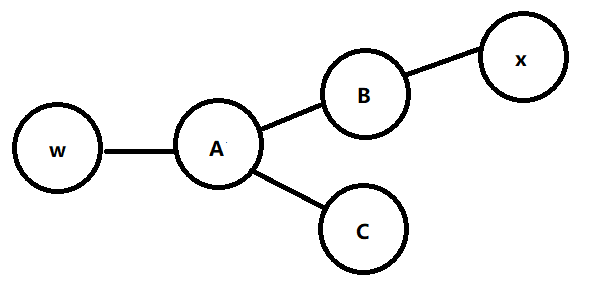
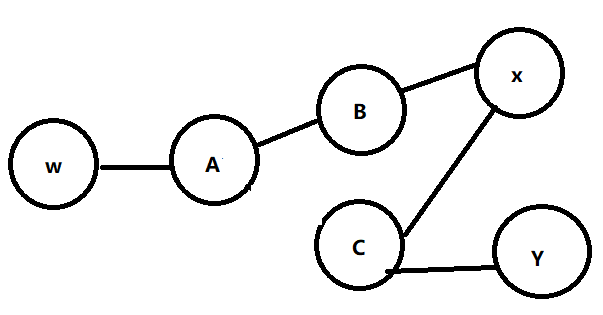

## 第10次作业


### p14



```
a. eBGP
b. iBGP
c. eBGP
d. iBGP
```


### p15



```
a. I1，因为ld到lc的最低成本路径是从I1出发的
b. I2，两个路由路径相同，但是下一跳最近的路由器在AS2
c. I1，因为AS3,AS4路径最短
```


### p17





1. W所见的拓扑视图：

   

2. X所见的拓扑视图：

   