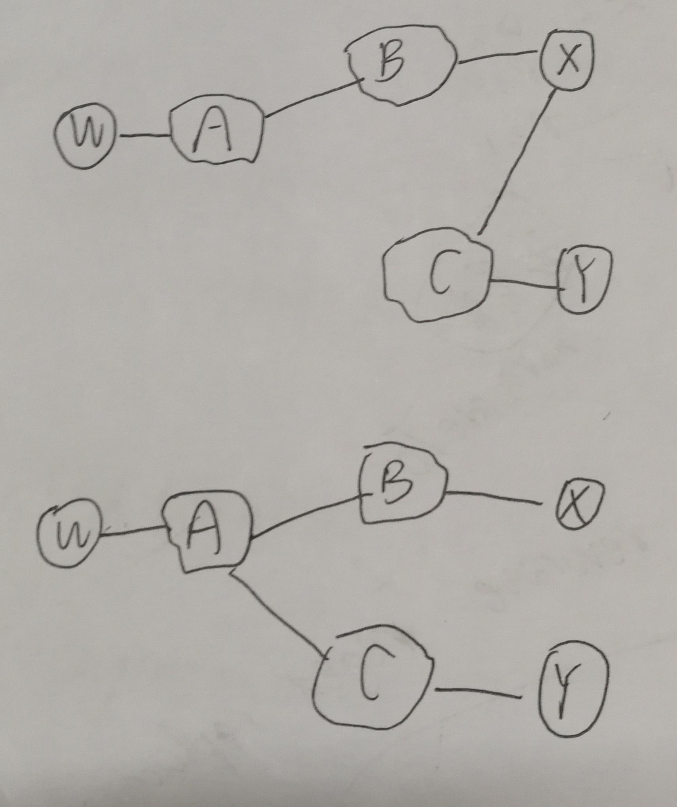
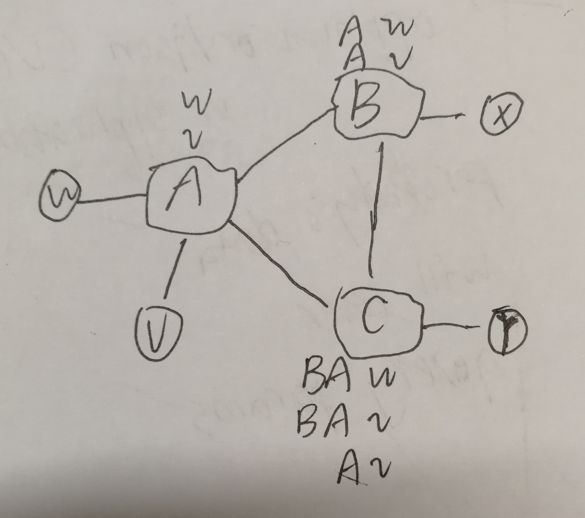

## HomeWork 9

学号：2017302580218

姓名：陈炳生

---

### P14

答：

- a. 路由器3c位于 AS3的边缘，与AS4的边界路由器4c相连，会通过 eBGP协议学习到前缀 x
- b. 路由器3a位于 AS3的内部，3c学到前缀x后，会通过 iBGP协议将信息传给3a
- c. 路由器1c位于 AS1的边缘，与AS3的边界路由器3a相连，会通过 eBGP协议从路由器 3a处学习到前缀 x
- d. 路由器1d位于 AS1的内部，1c学习到前缀x后，通过 iBGP协议向AS1内部的其他路由器发送 BGP报文，于是 1d可以学习到前缀 x

### P17

答：图中上半部分为 X所见的拓补视图，下半部分为 W所见的拓补视图

### P19

答：

如下图所示， V作为客户接入 ISP A。为满足题目条件， A向B通告了 A-w 和 A-v两条路由，同时向 C 通告了 A-v 路线；之后 B又会向 C通告 B-A-w 和 B-A-v 两条路线，所以 C收到的 AS路由有 B-A-w, B-A-v 和 A-v

