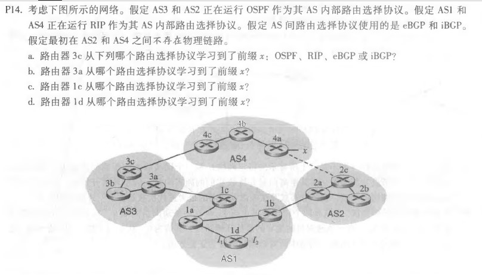
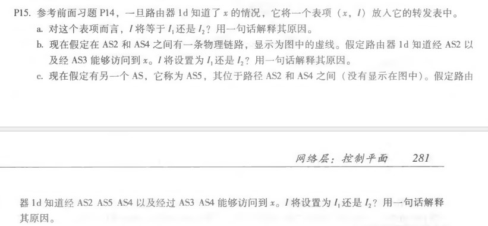

# 网络及分布式作业（十）

[toc]

## 课后习题

### P14

a. eBGP，3c从4c通过eBGP协议传递的通告学习到了前缀x。

b. iBGP，3c在获得x前缀后使用iBGP协议将通告信息进一步传递哥AS3中的路由器。

c. eBGP，1c从3a通过eBGP协议传递的通告学习到了前缀x。

d.  iBGP，1c在获得x前缀后使用iBGP协议将通告信息进一步传递哥AS1中的路由器。

### P15

a) I1。因为这个接口开始从 1D 到区域边界路由器 1c 的开销更小。

b) I2。这两种路由都有相等的区域路径长度(AS-PATH)，但这个接口到区域边界路由器（1b）的开销更小。

c) 若采用AS-PATH路径，会选择I1，因为I1开始具有更短的区域路径长度(AS-PATH)。

​	若采用热土豆路由，则仍会选择I2, 这个接口到区域边界路由器（1b）的开销更小。

### P21

请求响应模式通常会有更多的开销。  首先，管理实体收到的每一条信息都需要两条消息：请求和响应，而陷阱只向发送方生成一条消息。  如果管理器只希望在发生条件时才得到通知，那么轮询的开销就会更大，因为许多轮询消息的结果可能是变化未发生，这些轮询请求是没有意义的。陷阱模式只在条件发生时生成消息。

陷阱方式时效性更强。在发生事件时，陷阱模式会立即通知管理实体。使用请求响应模式，管理器需要等待被管设备被轮询到系统才会得知时间的发生，从事件发生到管理实体发现事件发生存在一定延迟。

请求响应模式更加健壮。 如果丢失了陷阱消息，托管设备将不会发送其他副本意味着这个事件可能不会被管理实体记录。如果一个请求消息或它的响应丢失了（或者超时），管理实体就会知道这一情况，如果需要，管理实体可以重新发起请求，不过与此同时，要维护一个计时又会为系统带来额外的开销。

2017302580240 陈超