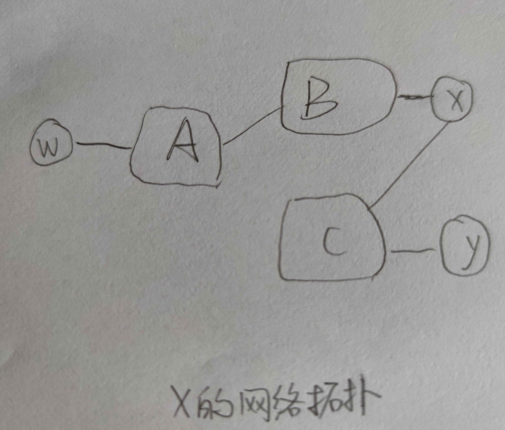
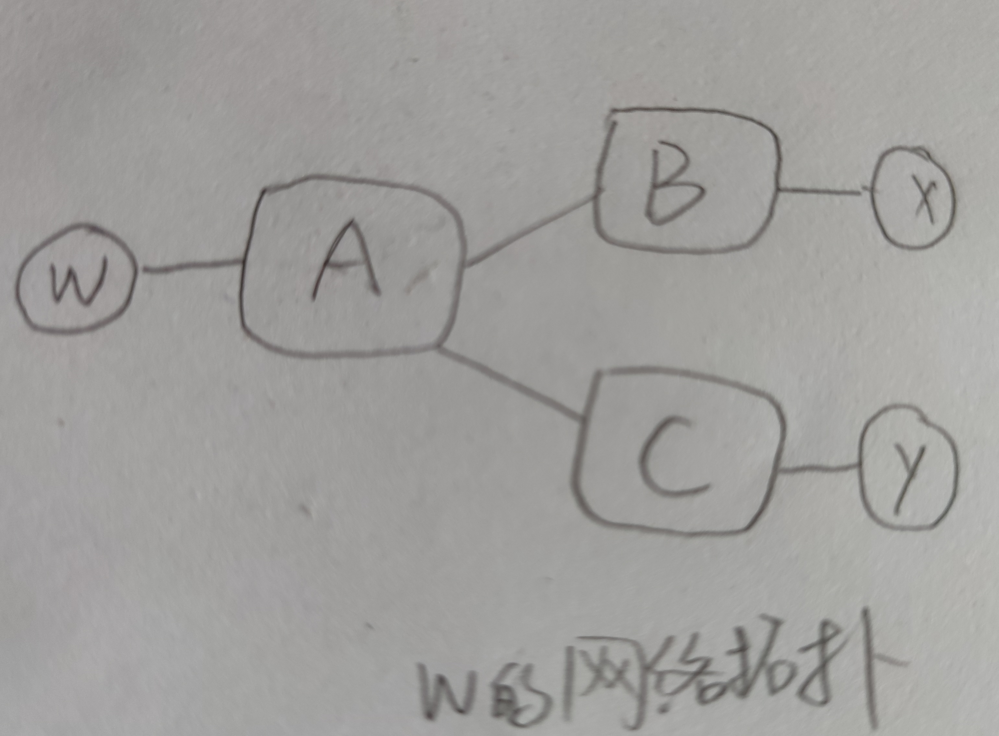

# 第五章习题

> **P17:**
>
> X和W的网络拓扑如下：
> 
> 
> 
> 

> **P19:**
>
> A应该建议B两条路线，A-W和A-V。
>
> A应该只向C建议一条路线，A-V。
> 
> C作为路径接收：B-A-W、B-A-V、A-V。

> **P20:**
>
> 由于Z想要传输Y的流量，Z将以这种方式向Y发送路由广告。这样，当Y有一个发送到可以通过Z到达的IP的数据报时，Y将可以选择通过Z发送该数据报。但是，如果Z将路由转发到Y，Y可以将这些路由重登到X。因此，在这种情况下，Z无法阻止从X到Z的传输。

