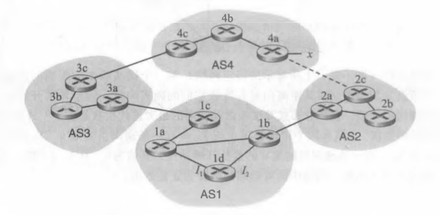
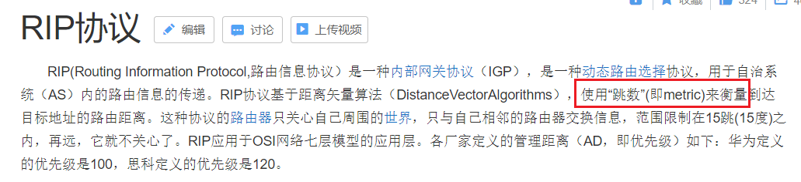
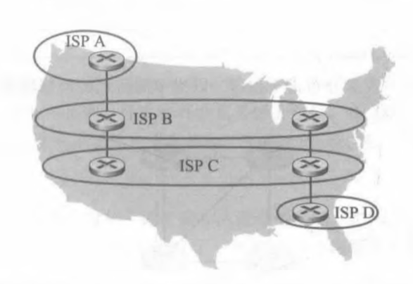
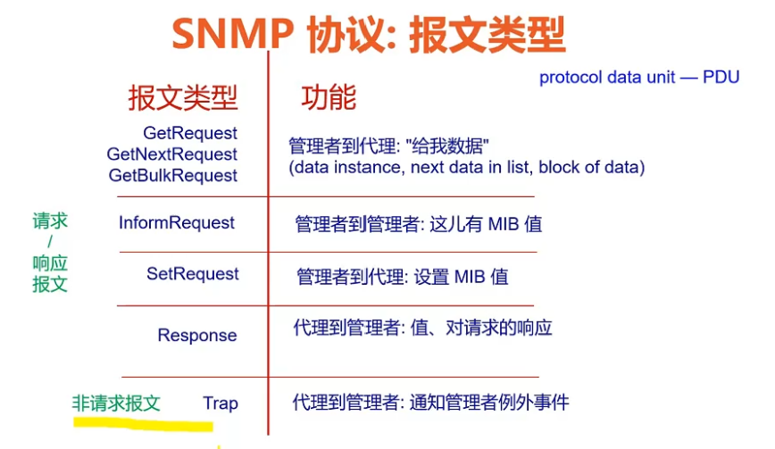

# Homework10

---

## 个人信息

- 班级：软工六班
- 学号：2017302580291
- 姓名：洪龙熙

---

## 作业

### 作业1

- 题目

> P14、15
>
> 考虑下图所示的网络。
>
> 
>
> 假定 AS3 和 AS2 正在运行 OSPF 作为其 AS 内部路由选择协议。假定 AS1 和 AS4 正在运行 RIP 作为其 AS 内部路由选择协议。假定 AS 间路由选择协议使用的是 eBGP 和 iBGP 。 假定最初在 AS2 和 AS4 之间不存在物理链路。 
>
> 1.  路由器 3c 从下列哪个路由选择协议学习到了前缀 x：OSPF、RIP, eBGP或iBGP? 
> 2.  路由器 3a 从哪个路由选择协议学习到了前缀 x? 
> 3.  路由器 1c 从哪个路由选择协议学习到了前缀 x？
> 4.  路由器 1d 从哪个路由选择协议学习到了前缀 x? 
>
>  —旦路由器 1d 知道了 x 的情况，它将一个表项 (x，I) 放入它的转发表中。
>
> 5.  对这个表项而言，I 将等于 I~1~ 还是 I~2~？用一句话解释其原因。
> 6.  现在假定在 AS2 和 AS4 之间有一条物理链路，显示为图中的虚线。假定路由器 1d 知道经 AS2 以及  AS3 能够访问到 x。I 将设置为 I~1~ 还是 I~2~？用一句话解释其原因。
> 7.  现在假定有另一个 AS，它称为 AS5，其位于路径 AS2 和 AS4 之间(没有显示在图中)。假定路由器 1d 知道经 AS2 AS5 AS4 以及经过 AS3 AS4 能够访问到 x。I 将设置为 I~1~ 还是 I ~2~？用一句话解释其原因。 

*   答案

    1.  eBGP

    2.  iBGP

    3.  eBGP

    4.  iBGP

    5.  I~1~。AS1 在运行 RIP 作为其 AS 內部路由选择协议，其主要考虑的是跳数，故应是 1c → 1a → 1d，故是 I~1~。

        RIP：

        

    6.  I~2~。AS4 也在运行 RIP，故 AS4 会选择由 4a 发送至 AS2 再发送至 AS1 的 1b，再根据 RIP 应该是 1b → 1d，故是 I~2~。

    7.  I~1~。AS3 AS4 的 AS-PATH 更短。

### 作业2

- 题目

> P16
>
> 考虑下面的网络。
>
> 
>
> ISP B 为地区 ISP A 提供国家级主干服务。ISP C 为地区 ISP D 提供国家级主干服务。每个 ISP 由一个 AS 组成。B 和 C 使用 BGP，在两个地方互相对等。考虑从 A 到 D 的流量。B 愿意将流量交给 C 传给西海岸（使得C将承担承载跨越整个国家的流量开销），而 C 愿意经其东海岸与 B 对等的站点得到这些流量（使得 B 将承载跨越整个国家的流量）。C 可能会使用什么样的 BGP 机制，使得 B 将通过东海岸对等点传递 A 到 D 的流量？要回答这个问题，你需要钻研 BGP 规范。

*   答案

    

    故，其机制应该是：只通过 ISP C 的西海岸站点告诉 ISP B 到达 ISP D 的路径。

### 作业3

- 题目

> P21
>
> 考虑在管理实体和被管设备之间发生通信的两种方式：请求/响应方式和陷阱方式。从以下方面考虑这两种方式的优缺点：①开销；②当异常事件出现时通知的时间；③对于管理实体和设备之间丢失报文的健壮性。 

*   答案

    具体截图如下：

    

    1.  开销：

        陷阱方式**略胜一筹**，请求/响应方式的开销较大。

        第一，在一次通信时，请求/响应方式有两条消息，请求和相应，而陷阱方式只需要一条消息。

        第二，请求/响应方式中，管理者会时不时向代理请求数据，正常情况下的开销只是为了确认安全，而陷阱方式只在异常发生时才进行通信，节省开销。

    2.  当异常事件出现时通知的时间：

        陷阱方式**略胜一筹**，请求/响应方式所耗时间可能更长。

        由图可知，请求/响应方式中的代理在未收到管理者信息时，不会主动发出数据，所以很有可能，是在刚发出情况正常报文的一时刻发生了异常情况，却因为未收到请求，而不发送报文；而陷阱方式则往往会在异常事件出现的第一时间通知管理者，通知的时间往往很短。

    3.  对于管理实体和设备之间丢失报文的健壮性：

        请求/响应方式**胜券在握**，陷阱方式丢失报文后容易无法挽回。

        请求/响应方式中若代理发送报文丢失，管理者会再次发出请求，故报文有把握到达管理者；

        陷阱方式中若代理发送的报文丢失，代理并不知道报文丢失，管理者也不知道代理发送了报文，这将导致因该报文的丢失而导致异常情况无挽回。

    综上，请求/响应方式更有优势，正如这句名言：
    >   正义也许会迟到，但绝不会缺席。
    
    
    
    开销再大、时间再晚，都没有“一失足成千古恨”的风险值得考虑。

