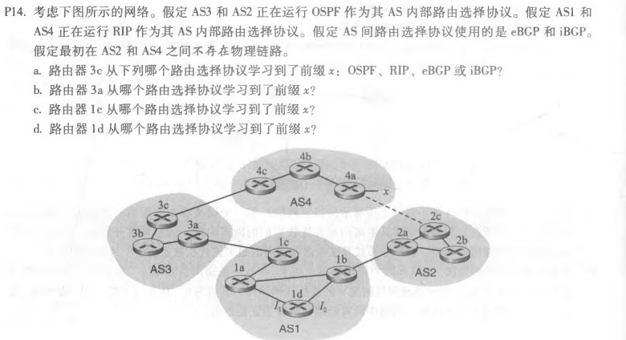

# 第十次作业
## 刘洋 2017302580294
P12: 
在BGP循环中从AS到目的地都提供了完整的路径信息检测。如果BGP对等体接收到包含自己的AS号的路由AS路径，然后使用该路由将导致环路。 

P13: 
选择的路径不一定是最短的路径。在路线选择过程中还需要考虑经济原因，有时较长的无环路路径很可能比较短的无环路路径更可取。 

P14: 
a、eBGP 
b、iBGP 
c、eBGP 
d、iBGP 