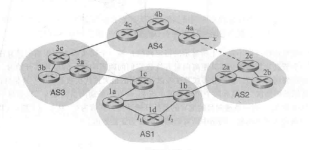
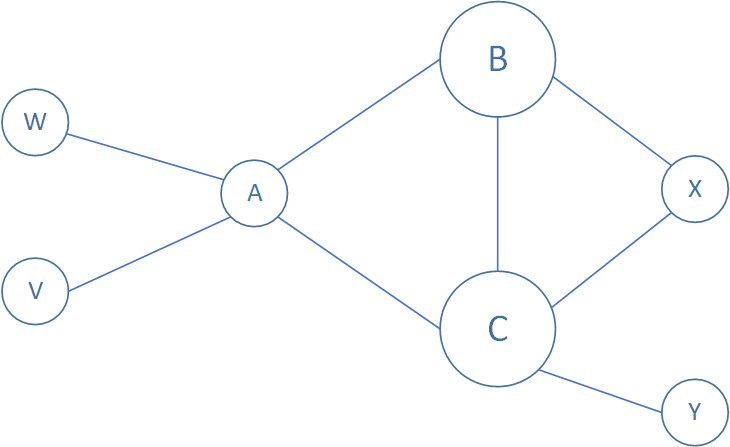

# 第五章思考题

## P14

**a.** 由于路由器3c和前缀x的子网不存在于同一个自治系统（AS），所以是从边界网关协议（BGP）中学习到前缀x。同时路由器3c是连接前缀x的子网所在AS4的网关路由器，包含前缀x信息的报文由路由器4c传给3c，所以是**从eBGP协议学习到前缀x**。

**b.** 由于路由器3a和前缀x的子网不存在于同一个自治系统（AS），所以是从边界网关协议（BGP）中学习到前缀x。虽然路由器3a是网关路由器，但是包含前缀x信息的报文只有通过路由器3b才能传给3a，所以其**从iBGP协议中学习到前缀x**。

**c.** 由于路由器1c和前缀x的子网不存在于同一个自治系统（AS），所以是从边界网关协议（BGP）中学习到前缀x。路由器1c为连接AS3的网关路由器，包含前缀x信息的报文由路由器3a传给1c，所以是**从eBGP协议学习到前缀x**。

**d.** 由于路由器1d和前缀x的子网不存在于同一个自治系统（AS），所以是从边界网关协议（BGP）中学习到前缀x。路由器1d是内部路由器，所以是**从iBGP协议学习到前缀x**。

## P15

**a.** $I$将等于$I_{1}$。因为包含前缀x信息的报文从1c到1d的最快的路由路径是1c直接到1a再直接到1d，从$I_{1}$接口传入路由器1d。

**b.**  $I$将被设置为$I_{2}$。此时，从1d到x的路径（AS-PATH）有两条：AS3-AS4-x和AS2-AS4-x，两条路径AS-PATH长度相同，但是从$I_{2}$开始的路径到NEXT-HOP的开销最小。

**c.**  $I$将被设置为$I_{1}$。因为两条路径中，AS3-AS4-x的路径长度（AS跳的跳数）最小。

## P19

再加入另一个桩网络V后，原BGP策略场景变为如下：

要使发向W的流量只来着B，发向V的流量来着B或C，那么A应该向B通知路由：A-W，A-V，向C通知路由：A-V，这样C就不知道到达W的路由，满足题目要求。

C收到的AS路由：A-V（来着A），B-A-W和B-A-V（来着B）。